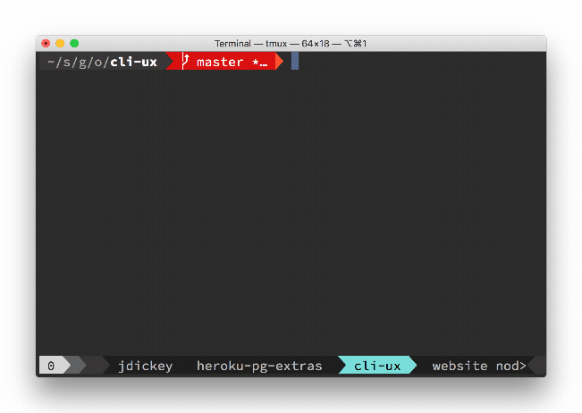

cli-ux
======

cli IO utilities

[](https://npmjs.org/package/cli-ux)
[](https://circleci.com/gh/oclif/cli-ux/tree/master)
[](https://ci.appveyor.com/project/heroku/cli-ux/branch/master)
[](https://codecov.io/gh/oclif/cli-ux)
[](https://greenkeeper.io/)
[](https://snyk.io/test/npm/cli-ux)
[](https://npmjs.org/package/cli-ux)
[](https://github.com/oclif/cli-ux/blob/master/package.json)

# Usage

The following assumes you have installed `cli-ux` to your project with `npm install cli-ux` or `yarn add cli-ux` and have it required in your script (TypeScript example):

```typescript
import cli from 'cli-ux'
cli.prompt('What is your name?')
```

# cli.prompt()

Prompt for user input.

```typescript
// just prompt for input
await cli.prompt('What is your name?')

// mask input after enter is pressed
await cli.prompt('What is your two-factor token?', {type: 'mask'})

// mask input on keypress (before enter is pressed)
await cli.prompt('What is your password?', {type: 'hide'})
```


